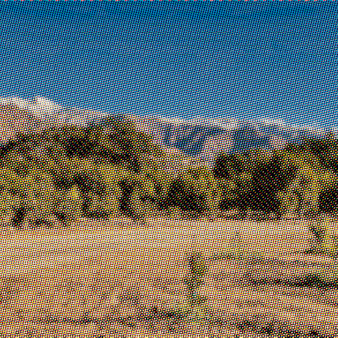

# halftoner

ink-first halftones from press profiles

[](https://github.com/bobbymeyer/halftoner/actions/workflows/ci.yml)

## quickstart

```sh
uv sync
uv run pytest
```

```sh
uv run halftoner profiles
uv run halftoner new job.json --profile newsprint_nominal --image photo.jpg \
    --size 180x240 --dpi 150 --ink k=#141414 --seed 7
uv run halftoner report job.json
uv run halftoner render job.json --target screen
```

## looks

| | | |
| :-- | :-- | :-- |
|  |  |  |
|  |  |  |

```sh
uv run python examples/styles.py --portrait face.jpg --night dusk.jpg \
    --colour orchard.jpg --graphic flat-art.jpg
```

Each flag is optional. A missing one falls back to a synthetic stand-in,
except `--colour`, whose panel is skipped; `--graphic` falls back to
`--colour`.

## commands

| Command | Does |
| --- | --- |
| `halftoner profiles` | List the bundled press profiles, their ruling, paper and provenance |
| `halftoner new OUT` | Write a recipe from a press profile |
| `halftoner report RECIPE` | Print the recipe report, and what a target would do with it |
| `halftoner render RECIPE` | Render a recipe to a target |
| `halftoner measure SCAN` | Measure a scan into a report, and optionally a draft profile |
| `halftoner calibrate PROFILE SCAN` | Measure a printed step wedge into a copy of a profile |

### new

| Flag | Default | Does |
| --- | --- | --- |
| `--profile` | required | Press profile name |
| `--size WxH` | required | Canvas size |
| `--unit` | `mm` | `mm`, `cm` or `in` |
| `--dpi` | `300` | Canvas resolution |
| `--bleed` | `0` | Bleed, in `--unit` |
| `--image` | — | Photo source; omit for a flat tint |
| `--tint` | `0.3` | Flat tint area when there is no image |
| `--ink NAME=#HEX` | — | An ink. Repeatable |
| `--process` | off | Separate `--image` into K, C, M, Y plates instead of `--ink` |
| `--overprint A+B=#HEX` | — | The colour where two inks overlap. Repeatable |
| `--ruling` | profile's | Override the ruling, in lpi |
| `--grid REPEAT[,REPEAT_Y]` | — | Lock screens to a layout grid repeat, in mm |
| `--grid-origin X,Y` | `0,0` | Where the layout grid starts, in mm |
| `--underbase` | off | Print a choked underbase first, from the profile |
| `--seed` | `0` | Seeds every stochastic step |

### render

| Flag | Default | Does |
| --- | --- | --- |
| `--target` | `screen` | `screen`, `svg`, `pod`, `film` or `pdf` |
| `--out` | `out` | Output directory |
| `--force` | off | Render past a refusing policy |
| `--supersample` | `4` | Raster supersampling factor |
| `--alpha` | pod `hard`, screen `none` | `hard`, `soft` or `none`. Transparent where no ink prints |
| `--film-dpi` | `1200` | Film positive resolution |
| `--no-wedge` | off | Leave the step wedge off the film sheet |
| `--size` | — | pod: a band name, or `all` for a file per band |
| `--bands` | bundled | pod: a size-bands JSON file |
| `--pdf-mode` | `vector` | `vector` dots, or `bitmap` 1-bit image masks per separation |
| `--bitmap-dpi` | `2400` | Mask resolution for `--pdf-mode bitmap` |
| `--output-condition` | substrate's, else FOGRA39 | PDF/X registered characterization |

### measure

| Flag | Default | Does |
| --- | --- | --- |
| `--inks N` | required | Inks on the sheet, 1–4 |
| `--dpi` | from file | Scan resolution, if the file does not record it |
| `--names` | — | Comma-separated ink names, darkest first |
| `--colors` | — | Comma-separated ink colours on white, if clustering cannot find them |
| `--key` | darkest | Ink the others register against |
| `--paper-box X,Y,W,H` | — | Unprinted area, in mm |
| `--patch X,Y,W,H=NOMINAL` | — | A flat tint patch, in mm. Repeatable |
| `--wedge X,Y,PATCH_W` | — | Step wedge top-left and patch width, in mm |
| `--patch-ink` | — | Ink the patches are printed in |
| `--item` | — | What was scanned: title, publisher, year |
| `--min-lpi` / `--max-lpi` | `15` / `400` | Ruling search bounds |
| `--profile-out` | — | Write a draft press profile here |
| `--name` | file stem | Profile name |

`calibrate` takes `--inks`, `--dpi`, `--names`, `--wedge`, `--patch`,
`--patch-ink` and `--item` with the same meanings, plus `--name` and `--out`
for the calibrated copy.

## profiles

| Name | Ruling | Paper | Provenance |
| --- | --- | --- | --- |
| `newsprint_nominal` | 65 lpi | `#E6DFCC` | `NOMINAL` |
| `uncoated_offset_nominal` | 85 lpi | `#F2EDE0` | `NOMINAL` |
| `plastisol_dark_garment_nominal` | 45 lpi | `#1B1B1D` | `NOMINAL` |

`NOMINAL` means generic ranges for the stock, not a measurement of any press.
`measure` and `calibrate` replace that with `DRAFT until checked`.

## targets and constraint policy

Every constraint is computed for every job. What happens when one fails
depends on the target.

| Constraint | screen | svg | pod | film | pdf |
| --- | --- | --- | --- | --- | --- |
| ruling past the paper's ceiling | report | report | **cap** | **refuse** | **refuse** |
| smallest dot below the printable minimum | report | report | report | **refuse** | **refuse** |
| sampling ratio | report | report | report | **refuse** | **refuse** |
| screen angle | report | report | report | **refuse** | **refuse** |
| geometry | ignore | warn | ignore | ignore | ignore |
| total area coverage | report | report | report | **refuse** | **refuse** |
| mean coverage | report | report | report | report | report |
| grid commensurability | report | report | report | report | report |
| underbase choke | report | report | report | report | report |

`report` lists it and renders. `warn` lists it loudly and renders. `cap`
clamps the value. `refuse` stops the render; `--force` overrides it.

## screens

Cell fills: `Round()`, `Square()`, `Elliptical(ratio=1.6)`,
`Diamond(ratio=1.6)`, `Line()`, and `Custom(name, spot)` for a fill function
of your own. A round dot joins its neighbours all at once, an elliptical one
joins along the long axis first, and a line screen never joins across.

Press artifacts are modelled per ink, not per RGB channel, and all seeded:
misregistration as a low-frequency walk, slur along the direction of travel,
and ink film thickness drifting across the sheet.

## print-on-demand sizes

`--target pod --size all` writes one file per band in the canvas's aspect
family.

| Family | S | M | L |
| --- | --- | --- | --- |
| 2:3 | 12×18 @ 300 | 16×24 @ 300 | 24×36 @ 200 |
| 3:4 | 9×12 @ 300 | 18×24 @ 300 | 30×40 @ 200 |
| 4:5 | 8×10 @ 300 | 16×20 @ 300 | 24×30 @ 200 |
| 5:7 | 5×7 @ 300 | 10×14 @ 300 | 20×28 @ 200 |
| 1:1 | 10×10 @ 300 | 16×16 @ 300 | 24×24 @ 200 |
| 11:14 | 11×14 @ 300 | 22×28 @ 200 | — |

Inches at dpi. `max_lpi` defaults to `dpi / 5`, so a screen cell always spans
at least five pixels.

## recipes

**For screen, or a proof.** `--target screen`. Nothing refuses; constraints
are listed. Add `--alpha hard` to leave the background unpainted where no ink
prints.

```sh
uv run halftoner render job.json --target screen --supersample 4
```

**To send a print shop film positives.** `--target film` writes 1-bit
separations at `--film-dpi`, mirrored, with registration marks, labels and a
step wedge. It refuses a job the paper cannot hold rather than letting the
shop find out.

```sh
uv run halftoner report job.json --target film   # check before you commit
uv run halftoner render job.json --target film
```

**To send a RIP a PDF.** `--target pdf` writes PDF/X-1a:2001, one
overprinting separation per ink, already screened so the RIP leaves the dots
alone. Use `--pdf-mode bitmap` for large or finely ruled jobs.

```sh
uv run halftoner render job.json --target pdf --output-condition FOGRA39
```

**To print on a dark garment.** Use the garment profile and `--underbase`.
White on cotton spreads much more than the colours printed over it, so the
underbase is choked and gain-compensated on its own curve.

```sh
uv run halftoner new shirt.json --profile plastisol_dark_garment_nominal \
    --image art.jpg --size 280x360 --ink white=#F4F4F0 --ink red=#C8102E --underbase
```

**To ask a press for a specific profile.** Print the step wedge that comes on
a film sheet, scan it, and feed it back. The numbers stop being generic.

```sh
uv run halftoner calibrate newsprint_nominal wedge-scan.tif \
    --inks 1 --dpi 1200 --wedge 12,200,6 --out my_press.json
```

For a scan of print you did not make, `measure` reads the paper, the inks and
their overprints, each screen's ruling and angle, the registration error
between plates, and the gain — and writes a draft profile from it.

```sh
uv run halftoner measure scan.tif --inks 2 --dpi 1200 \
    --item "title, publisher, year" --wedge 12,200,6 --patch-ink ink2 \
    --profile-out draft.json
```

## Python

```sh
uv run python examples/two_ink_poster.py [photo.jpg]
```

```python
import halftoner as ht

canvas = ht.Canvas.of(180, 240, unit="mm", dpi=150)
profile = ht.PressProfile.load("uncoated_offset_nominal")
job = profile.recipe(canvas=canvas, inks=profile.inks(("k", "#141414")),
                     source=ht.Image("photo.jpg"), seed=7)
job.render("screen", "out")
```

Exported: `Canvas`, `CellFill`, `Constant`, `Curve`, `Custom`, `Diamond`,
`Elliptical`, `Function`, `Gradient`, `Image`, `Ink`, `InkSet`, `Layered`,
`Masked`, `ModuleGrid`, `Polygon`, `Press`, `PressProfile`, `Recipe`, `Rect`,
`Report`, `Round`, `Screen`, `Square`, `Substrate`, `Transfer`, `Underbase`,
`area_to_tone`, `tone_to_area`, `CmykSeparation`, `ProcessChannel`,
`SizeBand`, `process_inks`.

`Recipe.render_pdf` and `Recipe.render_svg` write directly, bypassing target
policy.

## roadmap

Open work and non-goals are in [ROADMAP.md](ROADMAP.md).

## tech

Python 3.12+, numpy and pillow. `uv` for the environment; pytest and pypdf
for tests.

```sh
uv sync
uv run pytest        # 130 passing, 5 skipped
```
