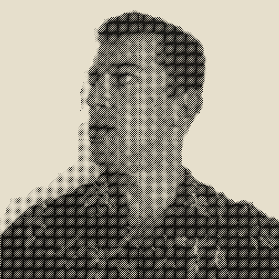
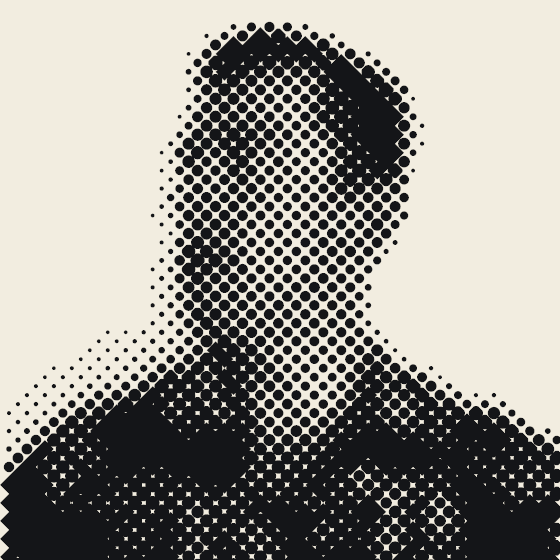
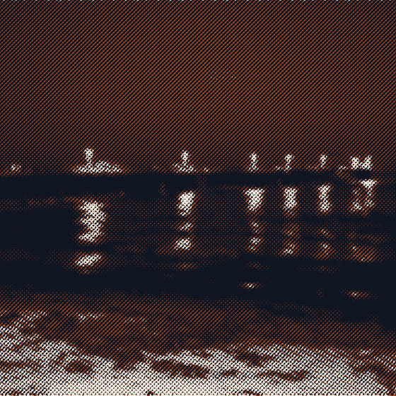
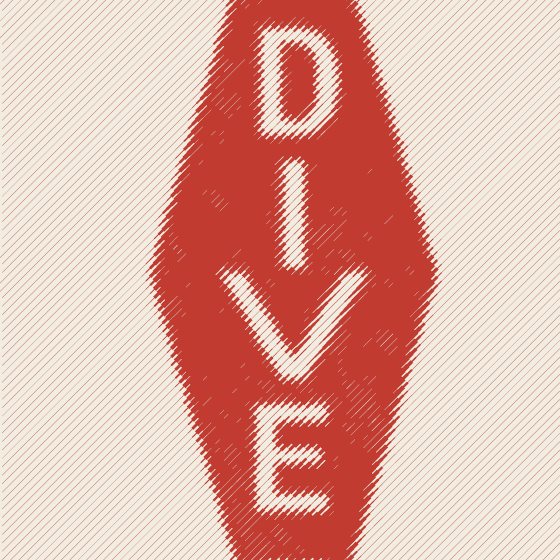
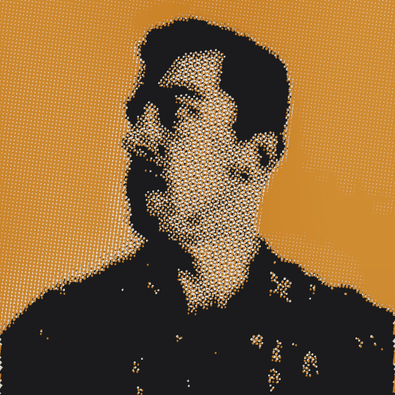

# halftoner

[](https://github.com/bobbymeyer/halftoner/actions/workflows/ci.yml)

Ink-first halftones from press profiles. A screen is a fill function over a grid; a job is an ink set; a recipe is the artifact and every output is a render of it.

```sh
uv sync
uv run pytest

uv run halftoner profiles
uv run halftoner new job.json --profile newsprint_nominal --image photo.jpg --size 180x240 --dpi 150 \
    --ink warm_red=#D6422B --ink prussian=#1F3A63 --overprint warm_red+prussian=#3A2036 --seed 7
uv run halftoner report job.json --target film      # report + what the film target would do
uv run halftoner render job.json --target screen    # screen | svg | pod | film | pdf  [--force]
uv run halftoner render job.json --target pod --size all          # a file per standard size band
uv run halftoner new cmyk.json --profile uncoated_offset_nominal --image photo.jpg --size 180x240 --process
uv run halftoner new grid.json --profile newsprint_nominal --image photo.jpg --size 180x240 --ink k=#111 --grid 20

uv run python examples/two_ink_poster.py [photo.jpg]  # the Python surface

uv run halftoner measure scan.tif --inks 2 --dpi 1200 --item "title, publisher, year" \
    --wedge 12,200,6 --patch-ink ink2 --profile-out draft.json   # scan -> report + DRAFT profile
```

## Looks

Five looks off three photographs. Same canvas, same seed, same 4x supersample — all that
changes between them is the profile, the ink set and the screen.

| | | |
| :-- | :-- | :-- |
|  |  |  |
| **Newsprint, one ink.** 65 lpi elliptical on a cream stock that spreads 28% at the midtone, compensated back on the plate. | **The screen as the subject.** The same face at 16 lpi. Nothing changed but the ruling. | **Two spot inks.** Midnight and rust on their own curves, overprinting a colour that was *chosen* — `#0F1622` — not computed. |
|  |  | |
| **Line screen.** Tone carried by line weight alone; the fill never joins across. Flat art, so the screen only does anything at the edges. | **On a near-black shirt.** Both inks are lighter than the garment, so `tone_range` auto reads the picture as *range*: more ink where the image is lighter, and the dark shirt prints as bare cotton. | |

Regenerate them with your own photographs:

```sh
uv run python examples/styles.py --portrait face.jpg --night dusk.jpg \
    --colour orchard.jpg --graphic logo.jpg
```

Any option you leave out falls back to a synthetic stand-in, except `--colour`, whose panel
is a four-ink separation and is skipped instead — a stand-in there would be demonstrating
the stand-in rather than the separation.

## Pipeline

```
PressProfile ── substrate · screen (ruling, shape, angle set) · press · tone model · ink defaults · provenance
  │  builds
  ▼
Recipe (saved as JSON: canvas, inks, overprints, sources, all params, seed)
  │
Source (image | constant | gradient | function, optionally Masked / Layered)
  │  sampled at each cell center, box-prefiltered to cell size
  ▼
Transfer   tone → area (Yule–Nielsen between the base and the ink's solid as printed) → coverage bias → ink curve → compression
           → inverse substrate gain → highlight drop / shadow snap           = plate area
  ▼
Plate      one per ink: rotated grid, per-cell area; printed = gain(plate) + press gain
  ▼
Report     sampling ratio, dot range, min dot diameter, coverage, palette, checks (always computed)
  ▼
Policy     per target: report | warn | cap | refuse (forceable)
  ▼
Targets    screen  supersampled, press artifacts, ink bitmask → Neugebauer primaries → linear box average → sRGB
           pod     screen at each size band, ruling capped, RGBA with hard alpha
           svg     one <path> per ink in mm; arcs below the join, traced polygons above
           film    per ink, 1-bit, no AA, no artifacts, mirrored; crop marks, reg targets, label, step wedge
           pdf     PDF/X-1a:2001: one overprinting spot separation per ink, pre-screened vector dots,
                   trim/bleed boxes, registration-color marks, registered output intent
```

## Press profiles

`src/halftoner/profiles/*.json`. One file holds everything a press implies:

```json
{
  "name": "newsprint_nominal",
  "provenance": "NOMINAL - generic newsprint ranges, not measured from scans",
  "measurements": [],
  "substrate": {"paper": "#E6DFCC", "ruling_ceiling_lpi": 85, "gain": 0.28, "min_dot": 0.08, "max_dot": 0.85,
                "min_printable_mm": 0.1, "compression": [0.1, 0.85]},
  "screen": {"ruling_lpi": 65, "shape": "round", "angles": [45, 75, 15, 0]},
  "press": {"misregistration": 0.3, "drift": 0.5, "slur": 0.04, "press_angle": 90,
            "density_variance": 0.06, "trap_gap": 0.0, "extra_gain": 0.0},
  "transfer": {"yule_nielsen_n": 1.8, "compensate_gain": true},
  "ink": {"density": 0.9, "opacity": 0.0}
}
```

`gain` is a number (TVI at 50%) or measured `[[nominal, printed], ...]` pairs. Inks take angles from the profile's angle set in print order. Anything can be overridden per recipe: `profile.recipe(..., press={"misregistration": 0.5})`.

The bundled profiles are labeled `NOMINAL`. A profile named for a tradition should come from measured scans (see `_template_measured.json.example`): ruling counted against trim size, angles read off a rotated crop, overprints sampled, plate walk measured. The film target's step wedge closes the gain loop: print it, measure the patches, feed the pairs back as `gain`.

## Grid-locked screens

`Screen(grid=ModuleGrid(repeat_mm, repeat_y_mm=None, origin=(x, y)))` (or `new --grid 20`) locks every plate to a layout grid's repeat (module plus gutter). A square lattice turned to an angle with tan = q/p repeats every pitch x sqrt(p² + q²) along both page axes, so each ink's angle snaps to the nearest such rational angle (0°, 14.04°, 18.43°, 26.57°, 45°, …, with p, q ≤ `max_ratio`) and its ruling snaps so a whole number of those periods spans the repeat. Every module then carries an identical dot arrangement, and the screen composes with the grid rather than sitting on top of it. The requested quadrant is kept, so elliptical dots stay oriented. The report lists each ink's target and locked ruling and angle, and flags a vertical repeat that isn't a whole number of periods. Capping keeps rulings locked and under the ceiling.

## Print on demand

The recipe is the artifact; size is an input to a run. `Recipe.at_size(w, h, dpi)` renders the same design at another size: art geometry scales (regions, gradients, image boxes, function coordinates, screen origin, layout grid) while press physics doesn't (ruling in lpi, misregistration, slur, trap gap, choke, bleed), so a bigger print carries more dots, not bigger ones.

`--target pod --size NAME|all` matches the design's aspect to standard print sizes (`pod_bands.json`: 2:3, 3:4, 4:5, 5:7, 1:1, 11:14, in either orientation) and writes a file per band, each rendered at its size and resolution with its ruling capped coarse (`max_lpi`, default dpi / 5, so every cell spans five pixels). `--bands file.json` supplies your own.

PoD files are RGBA with **hard alpha**: nothing is painted where no ink prints, inks are composited over white so the stock isn't baked in, and alpha is fully on or off (the inked fraction thresholded at half), which prints cleanly on transfers and apparel. `--alpha soft` keeps the fraction; `--alpha none` paints the substrate.

## CMYK process

`process_inks(photo, CmykSeparation(gcr, black_start, tac))` (or `new --process`) separates a photo into black, cyan, magenta and yellow plates, printed KCMY at 45/15/75/0°. It's a device separation: complementary CMY from sRGB, gray component replacement (black takes `gcr` of the shared gray once it passes `black_start`), undercolor removal, and a total-ink limit that holds black and scales CMY. For a separation matched to a printing condition, separate in an ICC workflow and feed the channels in as area sources.

Substrates carry `tac` (uncoated 300%, newsprint 240%); the report sums every plate at common points and film and PDF refuse past it. In PDF/X, process inks are DeviceCMYK (`1 0 0 0 k` with overprint mode 1, so the plates don't knock each other out) and any spot inks alongside stay Separations.

## Underbase (dark garments)

`Recipe(underbase=Underbase(...))`, `profile.recipe(..., underbase=True)`, or `halftoner new --underbase` adds a plate printed first, derived from where the colors print:

- **Demand**: at each underbase cell, the heaviest *printed* coverage of any color, each through its own tone chain, optionally weighted per ink (`weights={"navy": 0.5}` for less base under dark inks).
- **Choke** (`choke_mm`): tonal edges are eroded on the underbase's cell grid (minimum over a disk); region edges are cut at full resolution with every color region inset by the choke, so misregistration doesn't show a halo. The tonal erosion is quantised to whole cells, so a choke finer than one cell doesn't move a tonal edge at all — the report says so rather than letting it pass silently. `plastisol_dark_garment_nominal`'s 0.3 mm is 0.53 of a cell at its own 45 lpi, so on a photographic source only its region edges are choked; raise the choke or the ruling if you need the tonal ones too.
- **Own gain** (`gain`): compensated on its own curve, since white on cotton spreads far more than the colors on the flashed base.
- It prints first, so it's the key plate for misregistration, joins the palette (`underbase + gold`), the angle checks, ruling caps, film, and PDF separations.

The garment is the substrate's paper color. Inks with `opacity` cover with their own color, so plastisol over the base reads true while ink straight on the shirt sinks. `plastisol_dark_garment_nominal` is a starting profile (NOMINAL, not measured).

**Tone relative to the base.** An ink moves reflectance between the bare base and its own solid *as printed* (with its opacity, over any underbase); the report prints both for every ink. `Transfer(tone_range=...)`:

- `paper`: image white is the base; a dark ink darkens it, and tones darker than its solid clip. Ink on paper.
- `range`: image white and black map to the lighter and darker of base and solid. The only reading that works for a light ink on a dark garment (more ink where the image is lighter), and a way to spread a light ink across a whole photo on paper.
- `auto` (default): `range` when the solid is lighter than the base, otherwise `paper`, which is identical to the classic paper-relative mapping.

## Press artifacts

All seeded, all per ink (never per RGB channel), applied by the screen and pod targets and left off film.

| Artifact | Parameter | Model |
|---|---|---|
| Misregistration | `misregistration`, `drift`, `key` | per-plate constant offset plus low-frequency walk; the key plate stays put. Region cuts move with their plate |
| Slur | `slur`, `press_angle` | each dot smeared along the press direction |
| Density variance | `density_variance` | ink film thickness wanders across the sheet (±fraction, low frequency); each present ink's density scales Beer–Lambert style on top of its primary, so chosen overprints keep their character |
| Trap gap | `trap_gap` | masked regions are choked by half the gap, opening a paper hairline where regions meet. With misregistration, butted regions already gap on one side and overlap on the other |
| Uncorrected gain | `extra_gain` | an anti-curve applied on press |

Masked regions are cut at full resolution, the way a tint was cut from film: edge cells carry the region's value and their dots are sliced at the true edge (raster, film, and SVG clip paths).

## Measuring scans

`halftoner measure` turns a scan of real print into a report and a draft profile. Scan at 10+ pixels per screen cell: 1200 dpi covers screens up to 120 lpi; use 2400 dpi for finer work. Below that, blurred dot edges swamp the pure-ink pixels the separation relies on, and the report will say so.

| Reading | How |
|---|---|
| Paper | median of the lightest 2% of pixels, or `--paper-box` |
| Inks and overprints | pixels clustered in optical-density space into 2ⁿ primaries, each walked to its density peak; single inks are the subset whose sums best explain the rest. Overprints that aren't subtractive are flagged (chosen color, opaque ink, trap) |
| Ruling and angle | Fourier peak of each ink's unmixed amount map, pooled over a 3×3 grid of windows |
| Misregistration | each plate descreened and phase-correlated against the key plate in tiles: median = offset, spread = drift. Needs shared structure between plates |
| Gain and tone limits | effective Murray–Davies coverage on `--patch` boxes or a halftoner `--wedge`, measured on the solid's densest channel |

The draft's provenance is `DRAFT`; change it to `MEASURED` only after checking the numbers against the scan.

**Closing the gain loop.** Print a film sheet's step wedge on the press, scan it, and calibrate:

```sh
uv run halftoner calibrate uncoated_offset_nominal wedge_scan.tif --dpi 1200 --wedge 12,200,6 --patch-ink ink1 --out my_press.json
```

This writes a copy of the profile with only what the wedge measures replaced: `substrate.gain` (measured pairs), `min_dot` and `max_dot`, with `yule_nielsen_n` set to 1 because the pairs are effective coverage. The scan is appended to `measurements`, and provenance becomes `DRAFT`, naming the scan and keeping the original's provenance for everything else. Jobs built from it compensate for the press's real gain. Not measured: dot shape (set it from a loupe crop), slur, density variance.

Validated against renders with known parameters (`tests/test_measure.py`): ruling within 1%, angle within 0.5°, ink colors, registration offsets within 0.05 mm, gain within 2 points.

## Constraint policy

| Check | screen | svg | pod | film | pdf |
|---|---|---|---|---|---|
| Ruling ≤ substrate ceiling | report | report | cap | refuse | refuse |
| Smallest dot printable | report | report | report | refuse | refuse |
| Sampling ratio ≥ 1.0 | report | report | report | refuse | refuse |
| Ink angle separation ≥ 15° | report | report | report | refuse | refuse |
| Geometry count | – | warn | – | – | – |
| Coverage target reached | report | report | report | report | report |
| Total area coverage ≤ substrate TAC | report | report | report | refuse | refuse |
| Grid rows lock (non-square repeat) | report | report | report | report | report |
| Underbase choke reaches one cell | report | report | report | report | report |

## PDF/X

`--target pdf` writes PDF/X-1a:2001 (ISO 15930-1) separations for a printer:

- One `Separation` color space per ink, named for the ink; every dot is a 100% tint, so the RIP images the screen as drawn and never re-screens it. Each separation's DeviceCMYK alternate is a naive conversion for on-screen proofing only.
- Overprint on (`OP`, `op`, `OPM 1`) for everything: plates never knock each other out, and the press makes the overprint colors. A chosen overprint color is a property of the real inks, so it's recorded in the document's Keywords rather than encoded.
- TrimBox = canvas, BleedBox = canvas + bleed, 12 mm slug with crop marks and registration targets in the `All` color. Dots are clipped at the bleed.
- OutputIntent names a registered characterization without embedding a profile: `FOGRA39` (coated), `FOGRA29` (uncoated), `IFRA26` (newsprint). Set it per substrate (`output_condition`) or with `--output-condition`.
- No press artifacts, no fonts, no transparency; PDF 1.3.
- Two ways to carry the screen (`--pdf-mode`):
  - `vector` (default): every dot a path. Exact at any output resolution, but size grows with dot count, so it suits small or coarse jobs.
  - `bitmap`: each separation a 1-bit image mask over the bleed box at `--bitmap-dpi` (default 2400, platesetter resolution), rasterized and compressed strip by strip straight to disk. The usual way pre-screened art ships; use it for posters and fine rulings.
- Art runs into the bleed: plates are built out past it, and photos fill canvas plus bleed unless given a `box`.

Built to the standard and checked structurally and by rendering (`tests/test_pdf.py`), but not yet run through a PDF/X preflight (Acrobat Preflight, callas pdfToolbox). Preflight before sending a job.

`--force` / `render(force=True)` renders past a refusal and marks it in the outcome.

## Status against the spec

| # | Feature | State |
|---|---|---|
| 1–9 | Tone chain, ruling/angle/origin, dot shapes with joins, tone limits, gain curves, constant/gradient/region sources, single path per ink, sampling-ratio report, seeds | done |
| 10–11 | Ink set, overprint overrides, composite in ink space | done |
| 12 | Press artifacts | done: misregistration + drift, slur, density variance, trap gaps |
| 13 | Anti-curves, tone compression | done |
| 14 | Substrate / press profiles | done, nominal only until measured |
| 15 | Constraint engine | done: computed, reported, policy-gated per target |
| 16 | Supersampled raster export | done |
| 17 | Step wedge emitter + curve ingest | done: wedge on film sheets; `halftoner calibrate` writes measured gain and limits into a profile |
| 18 | Film positive export | done (registration marks, labels, mirrored, 1-bit) |
| 22 | Mean coverage as a settable target | done (`Ink(coverage=0.2)`) |
| 24 | PDF/X export with separations and overprint flags | done (PDF/X-1a:2001; not yet preflighted) |
| 19 | Underbase generation with choke, separately gain-compensated | done |
| 20 | Garment color as the compositing base, tone limits relative to it | done: garment is the paper, opaque inks cover it, tone maps between base and solid as printed |
| 21 | Grid-commensurate ruling | done: rational angles, a whole number of repeats per module |
| 23 | Hybrid AM/FM and blue-noise FM | not yet |
| — | Print-on-demand size bands and hard alpha | done |
| — | CMYK process separations | done: device separation with GCR and TAC; DeviceCMYK in PDF/X |
| — | resvg rasterizing | not planned: see below |

**Why not resvg.** The spec asks for compositing in ink space, never RGB layers with multiply. resvg would rasterize the SVG's multiply-blend preview, which is exactly that. The screen and pod targets already composite separations properly (overprint overrides, opacity, press artifacts), and large vector jobs belong in `--target pdf --pdf-mode bitmap`. SVG stays a preview and an editable vector export.
